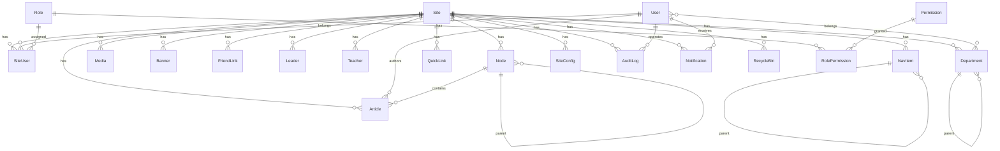
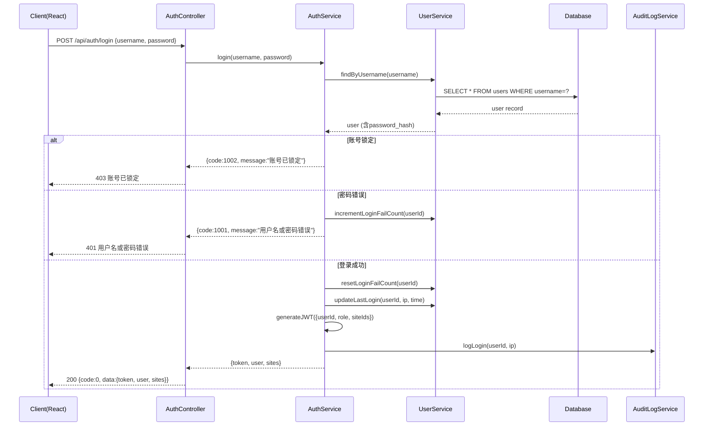
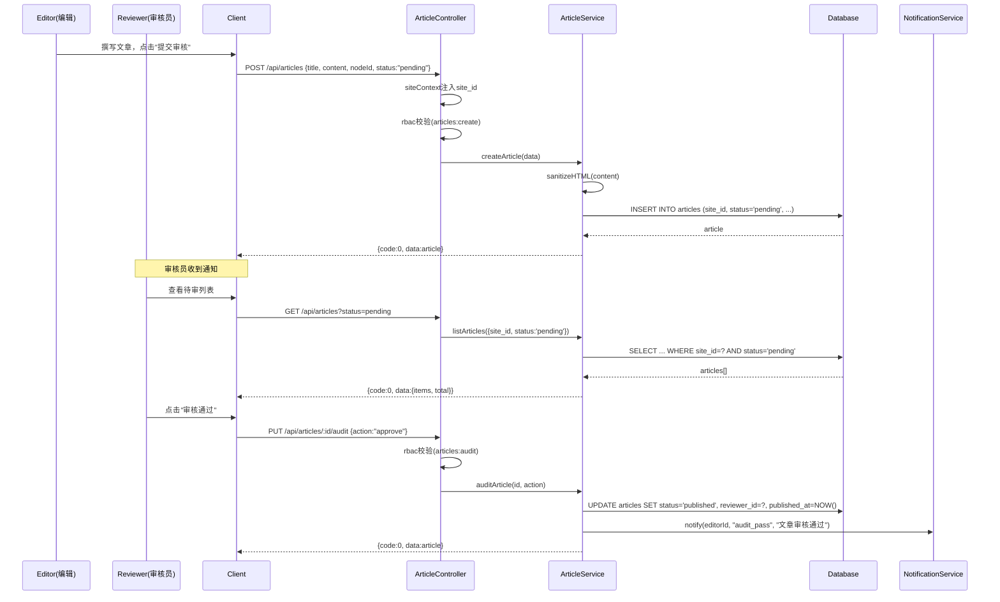
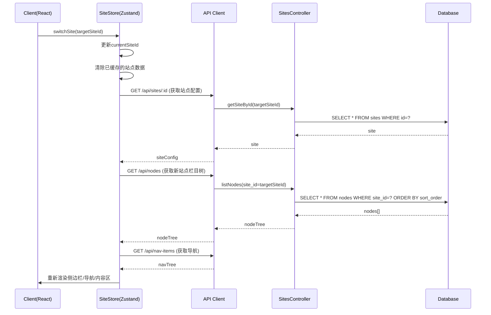
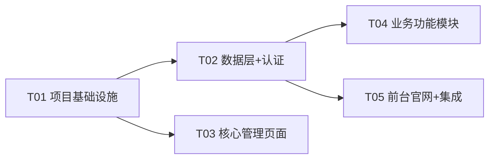

# 企业级CMS官网平台 — 系统架构设计文档

**项目代号**：enterprise_cms  
**文档版本**：v1.0.0  
**撰写日期**：2026-05-25  
**作者**：高见远（Gao）· 架构师  
**基于**：PRD v2.0.0（许清楚·产品经理）

---

## 一、实现方案与框架选型

### 1.1 核心技术挑战

| 挑战 | 解决方案 |
|------|---------|
| 多法人数据隔离 | 共享数据库 + site_id 字段隔离，中间件层强制注入 site_id 过滤 |
| RBAC权限控制 | 五级角色 + 权限矩阵 + 节点级权限覆盖，JWT Token携带角色与站点信息 |
| 富文本安全 | TinyMCE开源版 + 服务端XSS过滤（sanitize-html），白名单标签策略 |
| 文章状态机 | 状态字段 + 业务层校验，仅允许合法状态转换 |
| 多级栏目树 | parent_id 自引用 + 递归查询，Prisma支持递归CTE |
| 开发/生产数据库切换 | Prisma多环境配置，开发用SQLite，生产用PostgreSQL |

### 1.2 框架选型

| 层次 | 技术 | 版本 | 选型理由 |
|------|------|------|---------|
| **前端框架** | React | ^18.2.0 | 组件化、生态成熟、团队熟悉 |
| **前端构建** | Vite | ^5.0.0 | 极速HMR、ESM原生支持 |
| **UI组件库** | MUI (Material-UI) | ^5.14.0 | 企业级组件、主题定制、无障碍 |
| **CSS工具** | Tailwind CSS | ^3.4.0 | 原子化CSS、响应式快捷 |
| **前端路由** | React Router | ^6.20.0 | 声明式路由、嵌套路由 |
| **HTTP客户端** | Axios | ^1.6.0 | 拦截器、请求取消、TypeScript支持 |
| **富文本编辑器** | TinyMCE (开源版) | ^6.8.0 | 功能完整、可扩展、中文支持好 |
| **后端运行时** | Node.js | 18 LTS | 前后端同语言、非阻塞IO |
| **后端框架** | Express | ^4.18.0 | 轻量灵活、中间件生态丰富 |
| **ORM** | Prisma | ^5.8.0 | 类型安全、自动迁移、多数据库支持 |
| **数据库(生产)** | PostgreSQL | 15 | 企业级关系库、全文索引、JSON支持 |
| **数据库(开发)** | SQLite | 3 | 零配置、文件级、开发便捷 |
| **认证** | JWT (jsonwebtoken) | ^9.0.0 | 无状态、跨域友好 |
| **密码加密** | bcrypt | ^5.1.0 | 业界标准、盐值自动处理 |
| **安全** | helmet + csurf + express-validator | latest | HTTP安全头、CSRF防护、输入校验 |
| **缓存** | node-cache | ^5.10.0 | 内存键值缓存、TTL支持 |

### 1.3 架构模式

采用**前后端分离 + Monorepo**架构：

```
┌──────────────────────────────────────────────────────┐
│                    Nginx (反向代理)                     │
│              /api/* → Express:3001                    │
│              /*    → Vite:5173 (开发) / 静态文件 (生产)  │
├──────────────────────┬───────────────────────────────┤
│   Frontend (React)   │    Backend (Express)           │
│   Vite + MUI + TW    │    TypeScript + Prisma         │
│                      │                                │
│   Pages/Components/  │    Routes/Controllers/         │
│   Services/Stores    │    Services/Middleware/         │
│                      │    Models/                      │
├──────────────────────┴───────────────────────────────┤
│              Shared TypeScript Types                   │
├──────────────────────────────────────────────────────┤
│         SQLite (开发) / PostgreSQL (生产)              │
├──────────────────────────────────────────────────────┤
│              本地文件系统 (/uploads/{site_id}/)         │
└──────────────────────────────────────────────────────┘
```

---

## 二、项目目录结构

```
official-website/
├── docs/                          # 项目文档
│   ├── PRD.md
│   ├── ARCHITECTURE.md            # 本文件
│   ├── sequence-diagram.mermaid
│   └── class-diagram.mermaid
├── server/                        # 后端 API 服务
│   ├── package.json
│   ├── tsconfig.json
│   ├── .env.example               # 环境变量模板
│   ├── .env                       # 环境变量（git忽略）
│   ├── nodemon.json
│   ├── prisma/
│   │   ├── schema.prisma          # Prisma数据模型
│   │   ├── migrations/            # 数据库迁移
│   │   └── seed.ts                # 种子数据
│   ├── src/
│   │   ├── index.ts               # 入口文件
│   │   ├── app.ts                 # Express应用配置
│   │   ├── config/
│   │   │   └── index.ts           # 配置加载（环境变量）
│   │   ├── middleware/
│   │   │   ├── auth.ts            # JWT认证中间件
│   │   │   ├── siteContext.ts     # 站点上下文注入(site_id)
│   │   │   ├── rbac.ts            # RBAC权限校验
│   │   │   ├── csrf.ts            # CSRF防护
│   │   │   ├── validator.ts       # 请求参数校验
│   │   │   ├── upload.ts          # 文件上传(multer)
│   │   │   ├── errorHandler.ts    # 全局错误处理
│   │   │   └── auditLog.ts        # 操作日志记录
│   │   ├── routes/
│   │   │   ├── index.ts           # 路由汇总
│   │   │   ├── auth.routes.ts     # 认证路由
│   │   │   ├── sites.routes.ts    # 站点管理路由
│   │   │   ├── users.routes.ts    # 用户管理路由
│   │   │   ├── nodes.routes.ts    # 栏目管理路由
│   │   │   ├── articles.routes.ts # 文章管理路由
│   │   │   ├── media.routes.ts    # 文件管理路由
│   │   │   ├── banners.routes.ts  # 轮播图路由
│   │   │   ├── friendlinks.routes.ts  # 友情链接路由
│   │   │   ├── leaders.routes.ts  # 领导管理路由
│   │   │   ├── teachers.routes.ts # 师资管理路由
│   │   │   ├── navitems.routes.ts # 导航管理路由
│   │   │   ├── quicklinks.routes.ts   # 快捷入口路由
│   │   │   ├── notifications.routes.ts # 通知路由
│   │   │   ├── auditlogs.routes.ts    # 日志路由
│   │   │   ├── departments.routes.ts  # 部门路由
│   │   │   └── recyclebin.routes.ts   # 回收站路由
│   │   ├── controllers/
│   │   │   ├── auth.controller.ts
│   │   │   ├── sites.controller.ts
│   │   │   ├── users.controller.ts
│   │   │   ├── nodes.controller.ts
│   │   │   ├── articles.controller.ts
│   │   │   ├── media.controller.ts
│   │   │   ├── banners.controller.ts
│   │   │   ├── friendlinks.controller.ts
│   │   │   ├── leaders.controller.ts
│   │   │   ├── teachers.controller.ts
│   │   │   ├── navitems.controller.ts
│   │   │   ├── quicklinks.controller.ts
│   │   │   ├── notifications.controller.ts
│   │   │   ├── auditlogs.controller.ts
│   │   │   ├── departments.controller.ts
│   │   │   └── recyclebin.controller.ts
│   │   ├── services/
│   │   │   ├── auth.service.ts
│   │   │   ├── sites.service.ts
│   │   │   ├── users.service.ts
│   │   │   ├── nodes.service.ts
│   │   │   ├── articles.service.ts
│   │   │   ├── media.service.ts
│   │   │   ├── banners.service.ts
│   │   │   ├── friendlinks.service.ts
│   │   │   ├── leaders.service.ts
│   │   │   ├── teachers.service.ts
│   │   │   ├── navitems.service.ts
│   │   │   ├── quicklinks.service.ts
│   │   │   ├── notifications.service.ts
│   │   │   ├── auditlogs.service.ts
│   │   │   ├── departments.service.ts
│   │   │   └── recyclebin.service.ts
│   │   ├── utils/
│   │   │   ├── logger.ts          # 日志工具
│   │   │   ├── cache.ts           # 内存缓存
│   │   │   ├── xss.ts             # XSS过滤
│   │   │   └── helpers.ts         # 通用工具函数
│   │   └── types/
│   │       └── express.d.ts       # Express类型扩展
│   └── uploads/                   # 上传文件存储（git忽略）
│       └── {site_id}/             # 按站点隔离
├── client/                        # 前端 React 应用
│   ├── package.json
│   ├── tsconfig.json
│   ├── tsconfig.node.json
│   ├── vite.config.ts
│   ├── tailwind.config.ts
│   ├── postcss.config.js
│   ├── index.html
│   ├── public/
│   │   └── favicon.ico
│   └── src/
│       ├── main.tsx               # 入口文件
│       ├── App.tsx                # 根组件
│       ├── vite-env.d.ts
│       ├── api/                   # API 请求层
│       │   ├── client.ts          # Axios实例配置
│       │   ├── auth.ts
│       │   ├── sites.ts
│       │   ├── users.ts
│       │   ├── nodes.ts
│       │   ├── articles.ts
│       │   ├── media.ts
│       │   ├── banners.ts
│       │   ├── friendlinks.ts
│       │   ├── leaders.ts
│       │   ├── teachers.ts
│       │   ├── navitems.ts
│       │   ├── quicklinks.ts
│       │   ├── notifications.ts
│       │   ├── auditlogs.ts
│       │   ├── departments.ts
│       │   └── recyclebin.ts
│       ├── components/            # 通用组件
│       │   ├── Layout/
│       │   │   ├── AdminLayout.tsx      # 后台布局（顶栏+侧边栏+内容）
│       │   │   ├── Sidebar.tsx          # 侧边栏
│       │   │   ├── TopBar.tsx           # 顶部栏（站点切换+通知+用户）
│       │   │   └── SiteSwitcher.tsx     # 站点切换器
│       │   ├── Common/
│       │   │   ├── ConfirmDialog.tsx    # 确认弹窗
│       │   │   ├── DataTable.tsx        # 数据表格（分页/排序/搜索）
│       │   │   ├── LoadingOverlay.tsx   # 加载状态
│       │   │   ├── EmptyState.tsx       # 空状态
│       │   │   ├── Toast.tsx            # 消息提示
│       │   │   └── TreeView.tsx         # 树形视图
│       │   └── Editor/
│       │       └── RichTextEditor.tsx   # TinyMCE封装
│       ├── pages/                 # 页面组件
│       │   ├── admin/             # 后台管理页面
│       │   │   ├── Login.tsx            # 登录页
│       │   │   ├── Dashboard.tsx        # 仪表盘
│       │   │   ├── Sites.tsx            # 站点管理
│       │   │   ├── Users.tsx            # 用户管理
│       │   │   ├── Nodes.tsx            # 栏目管理
│       │   │   ├── Articles.tsx         # 文章列表
│       │   │   ├── ArticleEdit.tsx      # 文章编辑
│       │   │   ├── Media.tsx            # 文件管理
│       │   │   ├── Banners.tsx          # 轮播图管理
│       │   │   ├── FriendLinks.tsx      # 友情链接管理
│       │   │   ├── Leaders.tsx          # 领导管理
│       │   │   ├── Teachers.tsx         # 师资管理
│       │   │   ├── NavItems.tsx         # 导航管理
│       │   │   ├── QuickLinks.tsx       # 快捷入口管理
│       │   │   ├── AuditLogs.tsx        # 操作日志
│       │   │   └── SiteConfig.tsx       # 站点配置
│       │   └── portal/            # 前台官网页面
│       │       ├── Home.tsx             # 首页
│       │       ├── NewsList.tsx         # 新闻列表
│       │       ├── NewsDetail.tsx       # 新闻详情
│       │       ├── LeaderList.tsx       # 领导班子
│       │       └── TeacherList.tsx      # 师资队伍
│       ├── stores/                # 状态管理
│       │   ├── authStore.ts       # 认证状态
│       │   └── siteStore.ts       # 当前站点状态
│       ├── hooks/                 # 自定义Hooks
│       │   ├── useAuth.ts         # 认证Hook
│       │   ├── useSite.ts         # 站点Hook
│       │   └── usePermission.ts   # 权限Hook
│       ├── router/                # 路由配置
│       │   └── index.tsx          # 路由定义
│       ├── theme/                 # 主题配置
│       │   └── index.ts           # MUI主题定制
│       ├── styles/                # 全局样式
│       │   └── globals.css        # Tailwind全局样式
│       └── utils/                 # 工具函数
│           ├── constants.ts       # 常量定义
│           ├── formatters.ts      # 格式化工具
│           └── validators.ts      # 前端校验
├── shared/                        # 前后端共享类型
│   ├── package.json
│   └── src/
│       ├── types.ts               # 共享TypeScript类型
│       ├── enums.ts               # 枚举定义
│       └── api.ts                 # API接口类型
├── .gitignore
├── .eslintrc.cjs                  # ESLint配置
├── .prettierrc                    # Prettier配置
└── README.md
```

---

## 三、数据库设计

### 3.1 ER图



### 3.2 完整DDL（PostgreSQL语法）

```sql
-- ============================================================
-- 站点表
-- ============================================================
CREATE TABLE sites (
    id          UUID PRIMARY KEY DEFAULT gen_random_uuid(),
    name        VARCHAR(100) NOT NULL,
    name_en     VARCHAR(100),
    domain      VARCHAR(200),
    logo        VARCHAR(500),
    primary_color   VARCHAR(20) DEFAULT '#1a3a6b',
    secondary_color VARCHAR(20) DEFAULT '#c8a45c',
    phone       VARCHAR(50),
    email       VARCHAR(100),
    address     VARCHAR(300),
    icp         VARCHAR(100),
    police      VARCHAR(100),
    description TEXT,
    status      VARCHAR(20) NOT NULL DEFAULT 'active',  -- active/inactive
    created_at  TIMESTAMPTZ NOT NULL DEFAULT NOW(),
    updated_at  TIMESTAMPTZ NOT NULL DEFAULT NOW()
);

-- ============================================================
-- 用户表（全局用户）
-- ============================================================
CREATE TABLE users (
    id              UUID PRIMARY KEY DEFAULT gen_random_uuid(),
    username        VARCHAR(50) NOT NULL UNIQUE,
    password_hash   VARCHAR(200) NOT NULL,
    real_name       VARCHAR(50),
    email           VARCHAR(100),
    phone           VARCHAR(20),
    avatar          VARCHAR(500),
    status          VARCHAR(20) NOT NULL DEFAULT 'active',  -- active/disabled
    login_fail_count INTEGER NOT NULL DEFAULT 0,
    locked_until    TIMESTAMPTZ,
    last_login_at   TIMESTAMPTZ,
    last_login_ip   VARCHAR(45),
    created_at      TIMESTAMPTZ NOT NULL DEFAULT NOW(),
    updated_at      TIMESTAMPTZ NOT NULL DEFAULT NOW()
);

-- ============================================================
-- 角色表
-- ============================================================
CREATE TABLE roles (
    id          UUID PRIMARY KEY DEFAULT gen_random_uuid(),
    name        VARCHAR(50) NOT NULL,
    code        VARCHAR(50) NOT NULL UNIQUE,   -- super_admin/site_admin/editor/reviewer/visitor
    description TEXT,
    created_at  TIMESTAMPTZ NOT NULL DEFAULT NOW()
);

-- ============================================================
-- 权限表
-- ============================================================
CREATE TABLE permissions (
    id          UUID PRIMARY KEY DEFAULT gen_random_uuid(),
    resource    VARCHAR(50) NOT NULL,   -- sites/users/nodes/articles/media/banners...
    action      VARCHAR(20) NOT NULL,   -- create/read/update/delete/publish/audit
    description TEXT,
    created_at  TIMESTAMPTZ NOT NULL DEFAULT NOW(),
    UNIQUE(resource, action)
);

-- ============================================================
-- 角色-权限关联表
-- ============================================================
CREATE TABLE role_permissions (
    role_id       UUID NOT NULL REFERENCES roles(id) ON DELETE CASCADE,
    permission_id UUID NOT NULL REFERENCES permissions(id) ON DELETE CASCADE,
    PRIMARY KEY (role_id, permission_id)
);

-- ============================================================
-- 用户-站点-角色关联表
-- ============================================================
CREATE TABLE site_users (
    id          UUID PRIMARY KEY DEFAULT gen_random_uuid(),
    user_id     UUID NOT NULL REFERENCES users(id) ON DELETE CASCADE,
    site_id     UUID NOT NULL REFERENCES sites(id) ON DELETE CASCADE,
    role_id     UUID NOT NULL REFERENCES roles(id) ON DELETE RESTRICT,
    created_at  TIMESTAMPTZ NOT NULL DEFAULT NOW(),
    UNIQUE(user_id, site_id, role_id)
);

CREATE INDEX idx_site_users_user ON site_users(user_id);
CREATE INDEX idx_site_users_site ON site_users(site_id);

-- ============================================================
-- 部门表
-- ============================================================
CREATE TABLE departments (
    id          UUID PRIMARY KEY DEFAULT gen_random_uuid(),
    site_id     UUID NOT NULL REFERENCES sites(id) ON DELETE CASCADE,
    parent_id   UUID REFERENCES departments(id) ON DELETE SET NULL,
    name        VARCHAR(100) NOT NULL,
    sort_order  INTEGER NOT NULL DEFAULT 0,
    ext_fields  JSONB,
    status      VARCHAR(20) NOT NULL DEFAULT 'active',
    created_at  TIMESTAMPTZ NOT NULL DEFAULT NOW(),
    updated_at  TIMESTAMPTZ NOT NULL DEFAULT NOW()
);

CREATE INDEX idx_departments_site ON departments(site_id);
CREATE INDEX idx_departments_parent ON departments(parent_id);

-- ============================================================
-- 栏目/节点表
-- ============================================================
CREATE TABLE nodes (
    id          UUID PRIMARY KEY DEFAULT gen_random_uuid(),
    site_id     UUID NOT NULL REFERENCES sites(id) ON DELETE CASCADE,
    parent_id   UUID REFERENCES nodes(id) ON DELETE SET NULL,
    name        VARCHAR(100) NOT NULL,
    slug        VARCHAR(100),
    type        VARCHAR(20) NOT NULL DEFAULT 'category',  -- category/page/link
    icon        VARCHAR(100),
    sort_order  INTEGER NOT NULL DEFAULT 0,
    config      JSONB,            -- 栏目配置(列表模板/详情模板/每页条数等)
    status      VARCHAR(20) NOT NULL DEFAULT 'active',
    created_at  TIMESTAMPTZ NOT NULL DEFAULT NOW(),
    updated_at  TIMESTAMPTZ NOT NULL DEFAULT NOW()
);

CREATE INDEX idx_nodes_site ON nodes(site_id);
CREATE INDEX idx_nodes_parent ON nodes(parent_id);
CREATE INDEX idx_nodes_slug ON nodes(site_id, slug);

-- ============================================================
-- 文章表
-- ============================================================
CREATE TABLE articles (
    id              UUID PRIMARY KEY DEFAULT gen_random_uuid(),
    site_id         UUID NOT NULL REFERENCES sites(id) ON DELETE CASCADE,
    node_id         UUID REFERENCES nodes(id) ON DELETE SET NULL,
    title           VARCHAR(200) NOT NULL,
    content         TEXT,
    summary         VARCHAR(500),
    cover_image     VARCHAR(500),
    author_id       UUID REFERENCES users(id) ON DELETE SET NULL,
    reviewer_id     UUID REFERENCES users(id) ON DELETE SET NULL,
    source          VARCHAR(100),
    status          VARCHAR(20) NOT NULL DEFAULT 'draft',
        -- draft/pending/published/rejected/offline/trashed
    reject_reason   TEXT,
    published_at    TIMESTAMPTZ,
    view_count      INTEGER NOT NULL DEFAULT 0,
    is_top          BOOLEAN NOT NULL DEFAULT FALSE,
    sort_order      INTEGER NOT NULL DEFAULT 0,
    created_at      TIMESTAMPTZ NOT NULL DEFAULT NOW(),
    updated_at      TIMESTAMPTZ NOT NULL DEFAULT NOW()
);

CREATE INDEX idx_articles_site ON articles(site_id);
CREATE INDEX idx_articles_node ON articles(site_id, node_id);
CREATE INDEX idx_articles_status ON articles(site_id, status);
CREATE INDEX idx_articles_author ON articles(author_id);
CREATE INDEX idx_articles_published ON articles(site_id, published_at DESC);

-- ============================================================
-- 媒体文件表
-- ============================================================
CREATE TABLE media (
    id          UUID PRIMARY KEY DEFAULT gen_random_uuid(),
    site_id     UUID NOT NULL REFERENCES sites(id) ON DELETE CASCADE,
    user_id     UUID REFERENCES users(id) ON DELETE SET NULL,
    filename    VARCHAR(200) NOT NULL,
    filepath    VARCHAR(500) NOT NULL,
    mimetype    VARCHAR(100) NOT NULL,
    size        BIGINT NOT NULL DEFAULT 0,
    alt         VARCHAR(200),
    created_at  TIMESTAMPTZ NOT NULL DEFAULT NOW()
);

CREATE INDEX idx_media_site ON media(site_id);
CREATE INDEX idx_media_user ON media(user_id);

-- ============================================================
-- 轮播图表
-- ============================================================
CREATE TABLE banners (
    id          UUID PRIMARY KEY DEFAULT gen_random_uuid(),
    site_id     UUID NOT NULL REFERENCES sites(id) ON DELETE CASCADE,
    image       VARCHAR(500) NOT NULL,
    title       VARCHAR(200),
    subtitle    VARCHAR(200),
    link        VARCHAR(500),
    sort_order  INTEGER NOT NULL DEFAULT 0,
    status      VARCHAR(20) NOT NULL DEFAULT 'active',  -- active/inactive
    created_at  TIMESTAMPTZ NOT NULL DEFAULT NOW(),
    updated_at  TIMESTAMPTZ NOT NULL DEFAULT NOW()
);

CREATE INDEX idx_banners_site ON banners(site_id);

-- ============================================================
-- 友情链接表
-- ============================================================
CREATE TABLE friend_links (
    id          UUID PRIMARY KEY DEFAULT gen_random_uuid(),
    site_id     UUID NOT NULL REFERENCES sites(id) ON DELETE CASCADE,
    name        VARCHAR(100) NOT NULL,
    url         VARCHAR(500) NOT NULL,
    logo        VARCHAR(500),
    sort_order  INTEGER NOT NULL DEFAULT 0,
    status      VARCHAR(20) NOT NULL DEFAULT 'active',
    created_at  TIMESTAMPTZ NOT NULL DEFAULT NOW(),
    updated_at  TIMESTAMPTZ NOT NULL DEFAULT NOW()
);

CREATE INDEX idx_friend_links_site ON friend_links(site_id);

-- ============================================================
-- 领导表
-- ============================================================
CREATE TABLE leaders (
    id          UUID PRIMARY KEY DEFAULT gen_random_uuid(),
    site_id     UUID NOT NULL REFERENCES sites(id) ON DELETE CASCADE,
    name        VARCHAR(50) NOT NULL,
    position    VARCHAR(100),
    photo       VARCHAR(500),
    bio         TEXT,
    sort_order  INTEGER NOT NULL DEFAULT 0,
    status      VARCHAR(20) NOT NULL DEFAULT 'active',
    created_at  TIMESTAMPTZ NOT NULL DEFAULT NOW(),
    updated_at  TIMESTAMPTZ NOT NULL DEFAULT NOW()
);

CREATE INDEX idx_leaders_site ON leaders(site_id);

-- ============================================================
-- 师资表
-- ============================================================
CREATE TABLE teachers (
    id          UUID PRIMARY KEY DEFAULT gen_random_uuid(),
    site_id     UUID NOT NULL REFERENCES sites(id) ON DELETE CASCADE,
    name        VARCHAR(50) NOT NULL,
    title       VARCHAR(100),       -- 职称/头衔
    subject     VARCHAR(50),        -- 学科
    photo       VARCHAR(500),
    bio         TEXT,
    sort_order  INTEGER NOT NULL DEFAULT 0,
    status      VARCHAR(20) NOT NULL DEFAULT 'active',
    created_at  TIMESTAMPTZ NOT NULL DEFAULT NOW(),
    updated_at  TIMESTAMPTZ NOT NULL DEFAULT NOW()
);

CREATE INDEX idx_teachers_site ON teachers(site_id);

-- ============================================================
-- 导航项表
-- ============================================================
CREATE TABLE nav_items (
    id          UUID PRIMARY KEY DEFAULT gen_random_uuid(),
    site_id     UUID NOT NULL REFERENCES sites(id) ON DELETE CASCADE,
    parent_id   UUID REFERENCES nav_items(id) ON DELETE SET NULL,
    name        VARCHAR(50) NOT NULL,
    link        VARCHAR(500),
    icon        VARCHAR(100),
    sort_order  INTEGER NOT NULL DEFAULT 0,
    status      VARCHAR(20) NOT NULL DEFAULT 'active',
    created_at  TIMESTAMPTZ NOT NULL DEFAULT NOW(),
    updated_at  TIMESTAMPTZ NOT NULL DEFAULT NOW()
);

CREATE INDEX idx_nav_items_site ON nav_items(site_id);
CREATE INDEX idx_nav_items_parent ON nav_items(parent_id);

-- ============================================================
-- 快捷入口表
-- ============================================================
CREATE TABLE quick_links (
    id          UUID PRIMARY KEY DEFAULT gen_random_uuid(),
    site_id     UUID NOT NULL REFERENCES sites(id) ON DELETE CASCADE,
    name        VARCHAR(50) NOT NULL,
    icon        VARCHAR(100),
    link        VARCHAR(500),
    color       VARCHAR(20),
    sort_order  INTEGER NOT NULL DEFAULT 0,
    status      VARCHAR(20) NOT NULL DEFAULT 'active',
    created_at  TIMESTAMPTZ NOT NULL DEFAULT NOW(),
    updated_at  TIMESTAMPTZ NOT NULL DEFAULT NOW()
);

CREATE INDEX idx_quick_links_site ON quick_links(site_id);

-- ============================================================
-- 站点配置表
-- ============================================================
CREATE TABLE site_configs (
    id          UUID PRIMARY KEY DEFAULT gen_random_uuid(),
    site_id     UUID NOT NULL REFERENCES sites(id) ON DELETE CASCADE,
    config_key  VARCHAR(100) NOT NULL,
    config_value TEXT,
    created_at  TIMESTAMPTZ NOT NULL DEFAULT NOW(),
    updated_at  TIMESTAMPTZ NOT NULL DEFAULT NOW(),
    UNIQUE(site_id, config_key)
);

-- ============================================================
-- 操作日志表
-- ============================================================
CREATE TABLE audit_logs (
    id              UUID PRIMARY KEY DEFAULT gen_random_uuid(),
    site_id         UUID REFERENCES sites(id) ON DELETE SET NULL,
    user_id         UUID REFERENCES users(id) ON DELETE SET NULL,
    action          VARCHAR(50) NOT NULL,     -- create/update/delete/login/logout/publish/audit
    resource        VARCHAR(50) NOT NULL,     -- article/user/site/node/media...
    resource_id     VARCHAR(100),
    detail          JSONB,                    -- 操作详情
    ip              VARCHAR(45),
    user_agent      VARCHAR(500),
    created_at      TIMESTAMPTZ NOT NULL DEFAULT NOW()
);

CREATE INDEX idx_audit_logs_site ON audit_logs(site_id);
CREATE INDEX idx_audit_logs_user ON audit_logs(user_id);
CREATE INDEX idx_audit_logs_time ON audit_logs(created_at DESC);
CREATE INDEX idx_audit_logs_resource ON audit_logs(resource, resource_id);

-- ============================================================
-- 通知表
-- ============================================================
CREATE TABLE notifications (
    id          UUID PRIMARY KEY DEFAULT gen_random_uuid(),
    site_id     UUID REFERENCES sites(id) ON DELETE CASCADE,
    user_id     UUID NOT NULL REFERENCES users(id) ON DELETE CASCADE,
    type        VARCHAR(30) NOT NULL,    -- audit_pass/audit_reject/system/article_publish
    title       VARCHAR(200) NOT NULL,
    content     TEXT,
    is_read     BOOLEAN NOT NULL DEFAULT FALSE,
    link        VARCHAR(500),
    created_at  TIMESTAMPTZ NOT NULL DEFAULT NOW()
);

CREATE INDEX idx_notifications_user ON notifications(user_id, is_read);
CREATE INDEX idx_notifications_site ON notifications(site_id);

-- ============================================================
-- 回收站表
-- ============================================================
CREATE TABLE recycle_bin (
    id              UUID PRIMARY KEY DEFAULT gen_random_uuid(),
    site_id         UUID NOT NULL REFERENCES sites(id) ON DELETE CASCADE,
    resource_type   VARCHAR(50) NOT NULL,    -- article/node/media/banner...
    resource_id     UUID NOT NULL,
    resource_data   JSONB NOT NULL,          -- 原始数据快照
    deleted_by      UUID REFERENCES users(id) ON DELETE SET NULL,
    deleted_at      TIMESTAMPTZ NOT NULL DEFAULT NOW(),
    expires_at      TIMESTAMPTZ NOT NULL     -- 30天后自动清理
);

CREATE INDEX idx_recycle_bin_site ON recycle_bin(site_id);
CREATE INDEX idx_recycle_bin_expires ON recycle_bin(expires_at);

-- ============================================================
-- 节点权限表（栏目级权限覆盖）
-- ============================================================
CREATE TABLE node_permissions (
    id          UUID PRIMARY KEY DEFAULT gen_random_uuid(),
    node_id     UUID NOT NULL REFERENCES nodes(id) ON DELETE CASCADE,
    role_id     UUID REFERENCES roles(id) ON DELETE CASCADE,
    user_id     UUID REFERENCES users(id) ON DELETE CASCADE,
    can_read    BOOLEAN NOT NULL DEFAULT TRUE,
    can_create  BOOLEAN NOT NULL DEFAULT FALSE,
    can_update  BOOLEAN NOT NULL DEFAULT FALSE,
    can_delete  BOOLEAN NOT NULL DEFAULT FALSE,
    created_at  TIMESTAMPTZ NOT NULL DEFAULT NOW(),
    CONSTRAINT node_permission_target CHECK (role_id IS NOT NULL OR user_id IS NOT NULL)
);

CREATE INDEX idx_node_permissions_node ON node_permissions(node_id);
```

### 3.3 种子数据

```sql
-- 角色
INSERT INTO roles (id, name, code, description) VALUES
    ('r001', '超级管理员', 'super_admin', '平台全局管理，可操作所有站点'),
    ('r002', '站点管理员', 'site_admin', '单站点管理，管理本站点内容与人员'),
    ('r003', '内容编辑', 'editor', '内容采编，撰写和提交内容'),
    ('r004', '审核员', 'reviewer', '内容审核，审核和退稿'),
    ('r005', '普通用户', 'visitor', '前台浏览与投稿');

-- 权限项
INSERT INTO permissions (id, resource, action, description) VALUES
    -- 站点管理
    ('p001', 'sites', 'create', '创建站点'),
    ('p002', 'sites', 'read', '查看站点'),
    ('p003', 'sites', 'update', '编辑站点'),
    ('p004', 'sites', 'delete', '删除站点'),
    -- 用户管理
    ('p005', 'users', 'create', '创建用户'),
    ('p006', 'users', 'read', '查看用户'),
    ('p007', 'users', 'update', '编辑用户'),
    ('p008', 'users', 'delete', '删除用户'),
    -- 栏目管理
    ('p009', 'nodes', 'create', '创建栏目'),
    ('p010', 'nodes', 'read', '查看栏目'),
    ('p011', 'nodes', 'update', '编辑栏目'),
    ('p012', 'nodes', 'delete', '删除栏目'),
    -- 文章管理
    ('p013', 'articles', 'create', '创建文章'),
    ('p014', 'articles', 'read', '查看文章'),
    ('p015', 'articles', 'update', '编辑文章'),
    ('p016', 'articles', 'delete', '删除文章'),
    ('p017', 'articles', 'publish', '发布文章'),
    ('p018', 'articles', 'audit', '审核文章'),
    -- 文件管理
    ('p019', 'media', 'create', '上传文件'),
    ('p020', 'media', 'read', '查看文件'),
    ('p021', 'media', 'update', '编辑文件'),
    ('p022', 'media', 'delete', '删除文件'),
    -- 日志
    ('p023', 'auditlogs', 'read', '查看日志'),
    -- 站点配置
    ('p024', 'site_config', 'update', '编辑站点配置'),
    -- 导航/轮播/友链/领导/师资/快捷入口
    ('p025', 'navitems', 'manage', '管理导航'),
    ('p026', 'banners', 'manage', '管理轮播图'),
    ('p027', 'friendlinks', 'manage', '管理友情链接'),
    ('p028', 'leaders', 'manage', '管理领导信息'),
    ('p029', 'teachers', 'manage', '管理师资信息'),
    ('p030', 'quicklinks', 'manage', '管理快捷入口');

-- 角色-权限关联
-- 超级管理员：全部权限
INSERT INTO role_permissions (role_id, permission_id)
    SELECT 'r001', id FROM permissions;

-- 站点管理员：除站点CRUD和全局用户管理外的本站权限
INSERT INTO role_permissions (role_id, permission_id) VALUES
    ('r002', 'p002'), ('r002', 'p003'),
    ('r002', 'p005'), ('r002', 'p006'), ('r002', 'p007'), ('r002', 'p008'),
    ('r002', 'p009'), ('r002', 'p010'), ('r002', 'p011'), ('r002', 'p012'),
    ('r002', 'p013'), ('r002', 'p014'), ('r002', 'p015'), ('r002', 'p016'), ('r002', 'p017'), ('r002', 'p018'),
    ('r002', 'p019'), ('r002', 'p020'), ('r002', 'p021'), ('r002', 'p022'),
    ('r002', 'p023'),
    ('r002', 'p024'),
    ('r002', 'p025'), ('r002', 'p026'), ('r002', 'p027'), ('r002', 'p028'), ('r002', 'p029'), ('r002', 'p030');

-- 内容编辑：文章CRUD(本人)、文件上传/查看、栏目查看
INSERT INTO role_permissions (role_id, permission_id) VALUES
    ('r003', 'p010'),
    ('r003', 'p013'), ('r003', 'p014'), ('r003', 'p015'), ('r003', 'p016'),
    ('r003', 'p019'), ('r003', 'p020');

-- 审核员：文章审核/发布/查看
INSERT INTO role_permissions (role_id, permission_id) VALUES
    ('r004', 'p010'), ('r004', 'p014'),
    ('r004', 'p017'), ('r004', 'p018');

-- 普通用户：仅查看
INSERT INTO role_permissions (role_id, permission_id) VALUES
    ('r005', 'p002'), ('r005', 'p010'), ('r005', 'p014'), ('r005', 'p020');

-- 3个站点
INSERT INTO sites (id, name, name_en, domain, logo, primary_color, secondary_color, phone, email, address, icp, police, description, status) VALUES
    ('s001', '春阳教育集团', 'Chunyang Education Group', 'chunyang.localhost', 'https://cdn-icons-png.flaticon.com/512/3190/3190596.png', '#1a3a6b', '#c8a45c', '400-888-6688', 'info@chunyang.edu.cn', '江苏省南京市玄武区教育路188号', '苏ICP备2024001234号', '苏公网安备 32010202000123号', '春阳教育集团成立于1998年，是一所以高品质基础教育为核心的综合性教育集团。', 'active'),
    ('s002', '德育中学', 'Deyu Middle School', 'deyu.localhost', 'https://cdn-icons-png.flaticon.com/512/2995/2995459.png', '#1a6b3a', '#c8a45c', '025-87654321', 'info@deyu.edu.cn', '江苏省南京市鼓楼区德育路66号', '苏ICP备2024005678号', '苏公网安备 32010202000456号', '德育中学创建于1956年，是一所具有深厚文化底蕴的省级示范性中学。', 'active'),
    ('s003', '明德职业学校', 'Mingde Vocational School', 'mingde.localhost', 'https://cdn-icons-png.flaticon.com/512/3190/3190596.png', '#6b1a1a', '#c8a45c', '025-11223344', 'info@mingde.edu.cn', '江苏省南京市江宁区明德路99号', '苏ICP备2024009012号', '苏公网安备 32010202000789号', '明德职业学校是一所专注于职业教育与产业对接的现代化职业学校。', 'active');

-- 1个超级管理员 (密码: Admin@2026)
INSERT INTO users (id, username, password_hash, real_name, status) VALUES
    ('u001', 'admin', '$2b$10$placeholder_hash_will_be_generated_by_bcrypt', '系统管理员', 'active');

-- 超级管理员关联所有站点
INSERT INTO site_users (user_id, site_id, role_id) VALUES
    ('u001', 's001', 'r001'),
    ('u001', 's002', 'r001'),
    ('u001', 's003', 'r001');
```

> 注：实际种子数据中密码hash将由Prisma seed脚本通过bcrypt生成。

---

## 四、API设计

### 4.1 统一响应格式

```typescript
// 成功响应
{
    "code": 0,
    "data": T,
    "message": "success"
}

// 分页响应
{
    "code": 0,
    "data": {
        "items": T[],
        "total": number,
        "page": number,
        "pageSize": number,
        "totalPages": number
    },
    "message": "success"
}

// 错误响应
{
    "code": number,     // 非0错误码
    "data": null,
    "message": "错误描述"
}
```

### 4.2 错误码规范

| 错误码 | 含义 |
|--------|------|
| 0 | 成功 |
| 1001 | 用户名或密码错误 |
| 1002 | 账号已锁定 |
| 1003 | Token无效或过期 |
| 1004 | 权限不足 |
| 1005 | 资源不存在 |
| 1006 | 参数校验失败 |
| 1007 | 资源已存在 |
| 1008 | 操作不允许（如状态转换不合法） |
| 2001 | 文件上传失败 |
| 2002 | 文件类型不允许 |
| 2003 | 文件大小超限 |
| 9999 | 服务器内部错误 |

### 4.3 API列表

#### 认证模块 (auth)

| Method | Path | 描述 | 认证 |
|--------|------|------|------|
| POST | `/api/auth/login` | 用户登录 | 无 |
| POST | `/api/auth/logout` | 用户登出 | 需要 |
| GET | `/api/auth/me` | 获取当前用户信息 | 需要 |
| PUT | `/api/auth/password` | 修改密码 | 需要 |

#### 站点管理 (sites)

| Method | Path | 描述 | 认证 |
|--------|------|------|------|
| GET | `/api/sites` | 站点列表 | 需要(sites:read) |
| GET | `/api/sites/:id` | 站点详情 | 需要(sites:read) |
| POST | `/api/sites` | 创建站点 | 需要(sites:create, super_admin) |
| PUT | `/api/sites/:id` | 更新站点 | 需要(sites:update) |
| DELETE | `/api/sites/:id` | 删除站点 | 需要(sites:delete, super_admin) |

#### 用户管理 (users)

| Method | Path | 描述 | 认证 |
|--------|------|------|------|
| GET | `/api/users` | 用户列表(支持分页/搜索/角色筛选) | 需要(users:read) |
| GET | `/api/users/:id` | 用户详情 | 需要(users:read) |
| POST | `/api/users` | 创建用户 | 需要(users:create) |
| PUT | `/api/users/:id` | 更新用户 | 需要(users:update) |
| DELETE | `/api/users/:id` | 删除用户 | 需要(users:delete) |
| PUT | `/api/users/:id/status` | 启用/禁用用户 | 需要(users:update) |
| POST | `/api/users/:id/reset-password` | 重置用户密码 | 需要(users:update) |

#### 栏目管理 (nodes)

| Method | Path | 描述 | 认证 |
|--------|------|------|------|
| GET | `/api/nodes` | 栏目树(当前站点) | 需要(nodes:read) |
| GET | `/api/nodes/:id` | 栏目详情 | 需要(nodes:read) |
| POST | `/api/nodes` | 创建栏目 | 需要(nodes:create) |
| PUT | `/api/nodes/:id` | 更新栏目 | 需要(nodes:update) |
| DELETE | `/api/nodes/:id` | 删除栏目 | 需要(nodes:delete) |
| PUT | `/api/nodes/sort` | 栏目排序 | 需要(nodes:update) |

#### 文章管理 (articles)

| Method | Path | 描述 | 认证 |
|--------|------|------|------|
| GET | `/api/articles` | 文章列表(分页/状态/栏目/搜索) | 需要(articles:read) |
| GET | `/api/articles/:id` | 文章详情 | 需要(articles:read) |
| POST | `/api/articles` | 创建文章 | 需要(articles:create) |
| PUT | `/api/articles/:id` | 更新文章 | 需要(articles:update) |
| DELETE | `/api/articles/:id` | 删除文章(进回收站) | 需要(articles:delete) |
| PUT | `/api/articles/:id/submit` | 提交审核 | 需要(articles:update) |
| PUT | `/api/articles/:id/audit` | 审核通过/退稿 | 需要(articles:audit) |
| PUT | `/api/articles/:id/publish` | 发布文章 | 需要(articles:publish) |
| PUT | `/api/articles/:id/offline` | 下线文章 | 需要(articles:publish) |

#### 文件管理 (media)

| Method | Path | 描述 | 认证 |
|--------|------|------|------|
| GET | `/api/media` | 文件列表(分页/类型筛选) | 需要(media:read) |
| POST | `/api/media/upload` | 上传文件 | 需要(media:create) |
| DELETE | `/api/media/:id` | 删除文件 | 需要(media:delete) |
| GET | `/api/media/:id/download` | 下载文件 | 需要(media:read) |

#### 轮播图管理 (banners)

| Method | Path | 描述 | 认证 |
|--------|------|------|------|
| GET | `/api/banners` | 轮播图列表 | 需要(banners:manage) |
| POST | `/api/banners` | 创建轮播图 | 需要(banners:manage) |
| PUT | `/api/banners/:id` | 更新轮播图 | 需要(banners:manage) |
| DELETE | `/api/banners/:id` | 删除轮播图 | 需要(banners:manage) |
| PUT | `/api/banners/sort` | 轮播图排序 | 需要(banners:manage) |

#### 友情链接管理 (friendlinks)

| Method | Path | 描述 | 认证 |
|--------|------|------|------|
| GET | `/api/friend-links` | 友情链接列表 | 需要(friendlinks:manage) |
| POST | `/api/friend-links` | 创建友情链接 | 需要(friendlinks:manage) |
| PUT | `/api/friend-links/:id` | 更新友情链接 | 需要(friendlinks:manage) |
| DELETE | `/api/friend-links/:id` | 删除友情链接 | 需要(friendlinks:manage) |

#### 领导管理 (leaders)

| Method | Path | 描述 | 认证 |
|--------|------|------|------|
| GET | `/api/leaders` | 领导列表 | 需要(leaders:manage) |
| POST | `/api/leaders` | 创建领导 | 需要(leaders:manage) |
| PUT | `/api/leaders/:id` | 更新领导 | 需要(leaders:manage) |
| DELETE | `/api/leaders/:id` | 删除领导 | 需要(leaders:manage) |

#### 师资管理 (teachers)

| Method | Path | 描述 | 认证 |
|--------|------|------|------|
| GET | `/api/teachers` | 师资列表 | 需要(teachers:manage) |
| POST | `/api/teachers` | 创建教师 | 需要(teachers:manage) |
| PUT | `/api/teachers/:id` | 更新教师 | 需要(teachers:manage) |
| DELETE | `/api/teachers/:id` | 删除教师 | 需要(teachers:manage) |

#### 导航管理 (navitems)

| Method | Path | 描述 | 认证 |
|--------|------|------|------|
| GET | `/api/nav-items` | 导航树 | 需要(navitems:manage) |
| POST | `/api/nav-items` | 创建导航项 | 需要(navitems:manage) |
| PUT | `/api/nav-items/:id` | 更新导航项 | 需要(navitems:manage) |
| DELETE | `/api/nav-items/:id` | 删除导航项 | 需要(navitems:manage) |
| PUT | `/api/nav-items/sort` | 导航排序 | 需要(navitems:manage) |

#### 快捷入口管理 (quicklinks)

| Method | Path | 描述 | 认证 |
|--------|------|------|------|
| GET | `/api/quick-links` | 快捷入口列表 | 需要(quicklinks:manage) |
| POST | `/api/quick-links` | 创建快捷入口 | 需要(quicklinks:manage) |
| PUT | `/api/quick-links/:id` | 更新快捷入口 | 需要(quicklinks:manage) |
| DELETE | `/api/quick-links/:id` | 删除快捷入口 | 需要(quicklinks:manage) |

#### 通知管理 (notifications)

| Method | Path | 描述 | 认证 |
|--------|------|------|------|
| GET | `/api/notifications` | 通知列表(分页/已读未读) | 需要(登录即可) |
| PUT | `/api/notifications/:id/read` | 标记已读 | 需要(登录即可) |
| PUT | `/api/notifications/read-all` | 全部标记已读 | 需要(登录即可) |
| GET | `/api/notifications/unread-count` | 未读数量 | 需要(登录即可) |

#### 操作日志 (auditlogs)

| Method | Path | 描述 | 认证 |
|--------|------|------|------|
| GET | `/api/audit-logs` | 日志列表(分页/用户/时间/类型筛选) | 需要(auditlogs:read) |

#### 部门管理 (departments)

| Method | Path | 描述 | 认证 |
|--------|------|------|------|
| GET | `/api/departments` | 部门树 | 需要(users:read) |
| POST | `/api/departments` | 创建部门 | 需要(users:create) |
| PUT | `/api/departments/:id` | 更新部门 | 需要(users:update) |
| DELETE | `/api/departments/:id` | 删除部门 | 需要(users:delete) |

#### 回收站 (recyclebin)

| Method | Path | 描述 | 认证 |
|--------|------|------|------|
| GET | `/api/recycle-bin` | 回收站列表 | 需要(登录即可) |
| PUT | `/api/recycle-bin/:id/restore` | 恢复内容 | 需要(登录即可) |
| DELETE | `/api/recycle-bin/:id` | 永久删除 | 需要(登录即可) |

#### 前台公共API (portal，无需认证)

| Method | Path | 描述 | 认证 |
|--------|------|------|------|
| GET | `/api/portal/site` | 当前站点信息 | 无 |
| GET | `/api/portal/nav-items` | 导航树 | 无 |
| GET | `/api/portal/banners` | 轮播图列表 | 无 |
| GET | `/api/portal/articles` | 文章列表(分页/栏目) | 无 |
| GET | `/api/portal/articles/:id` | 文章详情(含浏览量+1) | 无 |
| GET | `/api/portal/leaders` | 领导列表 | 无 |
| GET | `/api/portal/teachers` | 师资列表 | 无 |
| GET | `/api/portal/friend-links` | 友情链接列表 | 无 |
| GET | `/api/portal/quick-links` | 快捷入口列表 | 无 |
| GET | `/api/portal/announcements` | 公告列表 | 无 |

> 前台API通过域名或`?site_id=`参数识别当前站点。

---

## 五、程序调用流程（时序图）

### 5.1 用户登录流程



### 5.2 文章创建→审核→发布流程



### 5.3 多站点切换流程



---

## 六、任务列表

### 任务依赖图



### T01: 项目基础设施（配置+入口+依赖声明）

- **依赖**：无
- **优先级**：P0
- **复杂度**：L
- **涉及文件**：
  ```
  server/package.json
  server/tsconfig.json
  server/nodemon.json
  server/.env.example
  server/.env
  server/src/index.ts
  server/src/app.ts
  server/src/config/index.ts
  server/src/middleware/errorHandler.ts
  server/prisma/schema.prisma

  client/package.json
  client/tsconfig.json
  client/tsconfig.node.json
  client/vite.config.ts
  client/tailwind.config.ts
  client/postcss.config.js
  client/index.html
  client/src/main.tsx
  client/src/App.tsx
  client/src/vite-env.d.ts
  client/src/styles/globals.css
  client/src/theme/index.ts
  client/src/router/index.tsx

  shared/package.json
  shared/src/types.ts
  shared/src/enums.ts
  shared/src/api.ts

  .gitignore (更新)
  .eslintrc.cjs
  .prettierrc
  ```
- **验收标准**：
  1. `npm run dev` 前后端均可启动，无报错
  2. Prisma schema 可生成迁移，seed可执行
  3. 前端访问 http://localhost:5173 可看到空白布局页
  4. 后端访问 http://localhost:3001/api/health 返回 `{code:0, data:{status:"ok"}}`
  5. TypeScript编译无错误
  6. ESLint + Prettier 配置生效

### T02: 数据层+认证+权限中间件

- **依赖**：T01
- **优先级**：P0
- **复杂度**：XL
- **涉及文件**：
  ```
  server/prisma/seed.ts
  server/src/middleware/auth.ts
  server/src/middleware/siteContext.ts
  server/src/middleware/rbac.ts
  server/src/middleware/csrf.ts
  server/src/middleware/validator.ts
  server/src/middleware/upload.ts
  server/src/middleware/auditLog.ts
  server/src/utils/logger.ts
  server/src/utils/cache.ts
  server/src/utils/xss.ts
  server/src/utils/helpers.ts
  server/src/types/express.d.ts
  server/src/routes/index.ts
  server/src/routes/auth.routes.ts
  server/src/routes/sites.routes.ts
  server/src/routes/users.routes.ts
  server/src/controllers/auth.controller.ts
  server/src/controllers/sites.controller.ts
  server/src/controllers/users.controller.ts
  server/src/services/auth.service.ts
  server/src/services/sites.service.ts
  server/src/services/users.service.ts
  server/src/services/auditlogs.service.ts

  client/src/api/client.ts
  client/src/api/auth.ts
  client/src/api/sites.ts
  client/src/api/users.ts
  client/src/stores/authStore.ts
  client/src/stores/siteStore.ts
  client/src/hooks/useAuth.ts
  client/src/hooks/useSite.ts
  client/src/hooks/usePermission.ts
  client/src/components/Layout/AdminLayout.tsx
  client/src/components/Layout/Sidebar.tsx
  client/src/components/Layout/TopBar.tsx
  client/src/components/Layout/SiteSwitcher.tsx
  client/src/components/Common/ConfirmDialog.tsx
  client/src/components/Common/DataTable.tsx
  client/src/components/Common/LoadingOverlay.tsx
  client/src/components/Common/EmptyState.tsx
  client/src/components/Common/Toast.tsx
  client/src/pages/admin/Login.tsx
  client/src/pages/admin/Dashboard.tsx
  client/src/pages/admin/Sites.tsx
  client/src/pages/admin/Users.tsx
  client/src/pages/admin/SiteConfig.tsx
  ```
- **验收标准**：
  1. 用户可登录/登出，JWT Token正确生成和验证
  2. 密码bcrypt加密存储，不明文存储
  3. 超级管理员可CRUD站点
  4. 超级管理员可CRUD用户、分配角色
  5. siteContext中间件正确注入site_id
  6. RBAC中间件正确拦截越权请求
  7. CSRF Token生成和验证正确
  8. 操作日志中间件记录关键操作
  9. 文件上传中间件工作正常（类型/大小限制）
  10. 登录失败5次锁定15分钟
  11. 后台布局（侧边栏+顶栏+内容区）正确渲染
  12. 站点切换器可切换站点，数据隔离正确

### T03: 核心管理页面（栏目+文章+文件）

- **依赖**：T02
- **优先级**：P0
- **复杂度**：XL
- **涉及文件**：
  ```
  server/src/routes/nodes.routes.ts
  server/src/routes/articles.routes.ts
  server/src/routes/media.routes.ts
  server/src/controllers/nodes.controller.ts
  server/src/controllers/articles.controller.ts
  server/src/controllers/media.controller.ts
  server/src/services/nodes.service.ts
  server/src/services/articles.service.ts
  server/src/services/media.service.ts

  client/src/api/nodes.ts
  client/src/api/articles.ts
  client/src/api/media.ts
  client/src/components/Common/TreeView.tsx
  client/src/components/Editor/RichTextEditor.tsx
  client/src/pages/admin/Nodes.tsx
  client/src/pages/admin/Articles.tsx
  client/src/pages/admin/ArticleEdit.tsx
  client/src/pages/admin/Media.tsx
  ```
- **验收标准**：
  1. 栏目支持3级树形结构，CRUD正常
  2. 栏目排序功能正常
  3. 文章CRUD正常，富文本编辑器可用
  4. 文章状态机正确：草稿→待审→已发布/已退稿→已下线→回收站
  5. 文章提交审核、审核通过/退稿功能正常
  6. 文件上传/预览/删除正常
  7. 文章可引用已上传文件（图片/附件）
  8. 所有操作强制site_id过滤，数据隔离正确
  9. XSS过滤对富文本内容生效

### T04: 业务功能模块（轮播图+友链+领导+师资+导航+快捷入口+通知+日志+部门+回收站）

- **依赖**：T02
- **优先级**：P0
- **复杂度**：L
- **涉及文件**：
  ```
  server/src/routes/banners.routes.ts
  server/src/routes/friendlinks.routes.ts
  server/src/routes/leaders.routes.ts
  server/src/routes/teachers.routes.ts
  server/src/routes/navitems.routes.ts
  server/src/routes/quicklinks.routes.ts
  server/src/routes/notifications.routes.ts
  server/src/routes/auditlogs.routes.ts
  server/src/routes/departments.routes.ts
  server/src/routes/recyclebin.routes.ts
  server/src/controllers/banners.controller.ts
  server/src/controllers/friendlinks.controller.ts
  server/src/controllers/leaders.controller.ts
  server/src/controllers/teachers.controller.ts
  server/src/controllers/navitems.controller.ts
  server/src/controllers/quicklinks.controller.ts
  server/src/controllers/notifications.controller.ts
  server/src/controllers/auditlogs.controller.ts
  server/src/controllers/departments.controller.ts
  server/src/controllers/recyclebin.controller.ts
  server/src/services/banners.service.ts
  server/src/services/friendlinks.service.ts
  server/src/services/leaders.service.ts
  server/src/services/teachers.service.ts
  server/src/services/navitems.service.ts
  server/src/services/quicklinks.service.ts
  server/src/services/notifications.service.ts
  server/src/services/departments.service.ts
  server/src/services/recyclebin.service.ts

  client/src/api/banners.ts
  client/src/api/friendlinks.ts
  client/src/api/leaders.ts
  client/src/api/teachers.ts
  client/src/api/navitems.ts
  client/src/api/quicklinks.ts
  client/src/api/notifications.ts
  client/src/api/auditlogs.ts
  client/src/api/departments.ts
  client/src/api/recyclebin.ts
  client/src/pages/admin/Banners.tsx
  client/src/pages/admin/FriendLinks.tsx
  client/src/pages/admin/Leaders.tsx
  client/src/pages/admin/Teachers.tsx
  client/src/pages/admin/NavItems.tsx
  client/src/pages/admin/QuickLinks.tsx
  client/src/pages/admin/AuditLogs.tsx
  ```
- **验收标准**：
  1. 轮播图CRUD + 排序 + 启用/禁用
  2. 友情链接CRUD + 排序 + 启用/禁用
  3. 领导CRUD + 排序 + 照片上传
  4. 师资CRUD + 排序 + 照片上传
  5. 导航树CRUD + 排序 + 启用/禁用
  6. 快捷入口CRUD + 排序 + 启用/禁用
  7. 通知列表 + 已读/未读 + 全部已读 + 未读计数
  8. 操作日志列表 + 筛选（用户/时间/类型）
  9. 部门树CRUD + 用户关联
  10. 回收站列表 + 恢复 + 永久删除
  11. 所有功能site_id隔离正确

### T05: 前台官网+最终集成

- **依赖**：T03, T04
- **优先级**：P0
- **复杂度**：L
- **涉及文件**：
  ```
  server/src/routes/index.ts (更新，增加portal路由)
  server/src/controllers/portal.controller.ts (新增，前台公共API)
  server/src/services/portal.service.ts (新增)

  client/src/pages/portal/Home.tsx
  client/src/pages/portal/NewsList.tsx
  client/src/pages/portal/NewsDetail.tsx
  client/src/pages/portal/LeaderList.tsx
  client/src/pages/portal/TeacherList.tsx
  client/src/router/index.tsx (更新，增加前台路由)
  client/src/App.tsx (更新)
  client/src/utils/constants.ts
  client/src/utils/formatters.ts
  client/src/utils/validators.ts
  ```
- **验收标准**：
  1. 前台首页完整渲染（轮播图+快捷入口+新闻+公告+师资+领导+友链）
  2. 新闻列表页分页正常
  3. 新闻详情页富文本正确渲染，浏览量+1
  4. 领导/师资列表页正确展示
  5. 响应式布局：桌面/平板/手机适配
  6. 前后台路由切换正常
  7. 前台数据按站点正确隔离（通过域名或site_id参数）
  8. 整体端到端流程可走通：登录→创建栏目→创建文章→发布→前台查看

---

## 七、依赖包列表

### 7.1 后端依赖 (server/package.json)

```json
{
  "dependencies": {
    "express": "^4.18.2",
    "prisma": "^5.8.0",
    "@prisma/client": "^5.8.0",
    "jsonwebtoken": "^9.0.2",
    "bcrypt": "^5.1.1",
    "helmet": "^7.1.0",
    "csurf": "^1.11.0",
    "cookie-parser": "^1.4.6",
    "express-validator": "^7.0.1",
    "multer": "^1.4.5-lts.1",
    "sanitize-html": "^2.11.0",
    "node-cache": "^5.10.2",
    "cors": "^2.8.5",
    "morgan": "^1.10.0",
    "dotenv": "^16.3.1",
    "uuid": "^9.0.0",
    "winston": "^3.11.0"
  },
  "devDependencies": {
    "typescript": "^5.3.3",
    "@types/express": "^4.17.21",
    "@types/jsonwebtoken": "^9.0.5",
    "@types/bcrypt": "^5.0.2",
    "@types/cookie-parser": "^1.4.6",
    "@types/multer": "^1.4.11",
    "@types/sanitize-html": "^2.9.5",
    "@types/cors": "^2.8.17",
    "@types/morgan": "^1.9.9",
    "@types/uuid": "^9.0.7",
    "ts-node": "^10.9.2",
    "nodemon": "^3.0.2",
    "eslint": "^8.56.0",
    "@typescript-eslint/eslint-plugin": "^6.15.0",
    "@typescript-eslint/parser": "^6.15.0",
    "prettier": "^3.1.1"
  }
}
```

### 7.2 前端依赖 (client/package.json)

```json
{
  "dependencies": {
    "react": "^18.2.0",
    "react-dom": "^18.2.0",
    "react-router-dom": "^6.20.0",
    "@mui/material": "^5.14.20",
    "@mui/icons-material": "^5.14.19",
    "@emotion/react": "^11.11.1",
    "@emotion/styled": "^11.11.0",
    "axios": "^1.6.2",
    "@tinymce/tinymce-react": "^4.3.2",
    "zustand": "^4.4.7",
    "dayjs": "^1.11.10",
    "notistack": "^3.0.1"
  },
  "devDependencies": {
    "typescript": "^5.3.3",
    "@types/react": "^18.2.43",
    "@types/react-dom": "^18.2.17",
    "@vitejs/plugin-react": "^4.2.1",
    "vite": "^5.0.8",
    "tailwindcss": "^3.4.0",
    "postcss": "^8.4.32",
    "autoprefixer": "^10.4.16",
    "eslint": "^8.56.0",
    "@typescript-eslint/eslint-plugin": "^6.15.0",
    "@typescript-eslint/parser": "^6.15.0",
    "eslint-plugin-react-hooks": "^4.6.0",
    "prettier": "^3.1.1"
  }
}
```

### 7.3 共享类型依赖 (shared/package.json)

```json
{
  "name": "@cms/shared",
  "version": "1.0.0",
  "main": "src/index.ts",
  "dependencies": {
    "typescript": "^5.3.3"
  }
}
```

---

## 八、共享知识（跨文件约定）

### 8.1 API响应格式

```typescript
interface ApiResponse<T> {
    code: number;      // 0=成功，非0=错误码
    data: T | null;
    message: string;
}

interface PaginatedData<T> {
    items: T[];
    total: number;
    page: number;
    pageSize: number;
    totalPages: number;
}
```

### 8.2 认证Token格式

- **类型**：JWT (HS256)
- **载荷**：
  ```json
  {
    "userId": "uuid",
    "username": "string",
    "roleCode": "super_admin|site_admin|editor|reviewer|visitor",
    "siteIds": ["uuid1", "uuid2"],
    "currentSiteId": "uuid",
    "iat": 1234567890,
    "exp": 1234567890
  }
  ```
- **有效期**：Access Token 8小时
- **存储**：前端存储在localStorage，请求头 `Authorization: Bearer <token>`
- **刷新**：MVP阶段不实现Refresh Token，过期重新登录

### 8.3 日期时间格式

- 数据库存储：`TIMESTAMPTZ`（UTC）
- API传输：ISO 8601 UTC字符串 `2026-05-25T10:30:00Z`
- 前端展示：使用dayjs按用户时区格式化 `2026-05-25 18:30:00`

### 8.4 分页格式

- 请求参数：`?page=1&pageSize=20`
- 默认值：page=1, pageSize=20
- 可选pageSize：10, 20, 50

### 8.5 文件命名规范

- 组件文件：PascalCase（`ArticleEdit.tsx`）
- 工具/Hook文件：camelCase（`useAuth.ts`, `formatters.ts`）
- 路由文件：`{module}.routes.ts`
- 控制器文件：`{module}.controller.ts`
- 服务文件：`{module}.service.ts`
- 样式文件：`globals.css`（仅全局样式）
- 目录名：PascalCase(页面) / camelCase(其他)

### 8.6 代码风格约定

- TypeScript严格模式（strict: true）
- 缩进：2空格
- 引号：单引号
- 分号：必须
- 行宽：120字符
- 组件导出：默认导出（页面组件）/ 命名导出（工具函数）
- API路径：kebab-case（`/api/friend-links`）
- 数据库列名：snake_case（`site_id`, `created_at`）
- TypeScript变量/函数：camelCase
- TypeScript类型/接口：PascalCase

### 8.7 多法人site_id约定

- 所有业务表必须有 `site_id` 字段
- `siteContext` 中间件从JWT Token提取 `currentSiteId`，注入到 `req.siteId`
- 所有 Service 层查询必须包含 `site_id` 条件（超级管理员查看所有站点时除外）
- 文件存储路径：`/uploads/{site_id}/...`
- 前台API通过请求头 `X-Site-Id` 或域名识别站点

### 8.8 安全编码约定

- 密码：bcrypt, saltRounds=10
- XSS：所有用户输入的HTML内容经过 `sanitize-html` 白名单过滤
- CSRF：双重提交Cookie模式
- SQL注入：Prisma参数化查询，禁止字符串拼接SQL
- 文件上传：白名单扩展名（jpg/jpeg/png/gif/pdf/doc/docx/xls/xlsx/ppt/pptx/mp4），最大50MB
- 响应头：helmet设置安全HTTP头（X-Content-Type-Options, X-Frame-Options等）

---

## 九、待明确事项

| 编号 | 问题 | 影响范围 | 建议默认方案 |
|------|------|---------|------------|
| A-01 | 前台站点识别方式：子域名 vs 路径参数 vs 请求头？ | Portal API设计、Nginx配置 | MVP先用 `X-Site-Id` 请求头 + URL参数`?site_id=`，后续支持子域名 |
| A-02 | 超级管理员切换站点时，是否需要重新认证？ | siteContext中间件 | 不需要，切换站点仅更新Token中currentSiteId，前端刷新数据即可 |
| A-03 | 文章审核在P0阶段是否实现？P0需求中未明确要求审核流程 | 文章状态机 | P0阶段简化：site_admin/editor可直接发布，审核流程在P1实现。文章状态仅 draft/published/offline/trashed |
| A-04 | TinyMCE的API Key如何获取？开源版是否需要Key？ | 富文本编辑器 | TinyMCE开源版（自托管）无需API Key，从npm安装自托管 |
| A-05 | 开发环境是否需要Docker Compose？ | 开发环境搭建 | MVP不用Docker，直接本地 `npm run dev`，生产部署时再容器化 |
| A-06 | 站点删除策略：软删除还是硬删除？级联删除规则？ | 站点管理 | 站点用软删除（status=inactive），不物理删除；关联数据保留 |
| A-07 | Prisma schema中UUID的生成方式：`uuid()` vs `autoincrement()`？ | 数据库兼容性 | 使用 `uuid()`（`@default(uuid())`），SQLite和PostgreSQL均兼容 |
| A-08 | 是否需要WebSocket实时通知？ | 通知系统 | MVP用轮询（前端定时GET `/api/notifications/unread-count`，30秒间隔），后续升级WebSocket |
| A-09 | 回收站自动清理策略如何实现？ | 回收站 | 使用定时任务（node-cron），每天检查 expires_at 并清理过期记录 |
| A-10 | 前端状态管理选择：Zustand vs Context API vs Redux？ | 前端架构 | 使用Zustand，轻量、TypeScript友好、适合中小项目 |

---

*文档结束。本文档是工程师实现开发的基础输入，如有疑问请联系架构师高见远确认。*
